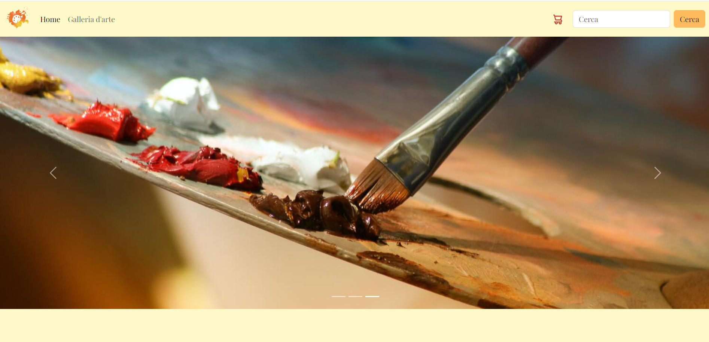
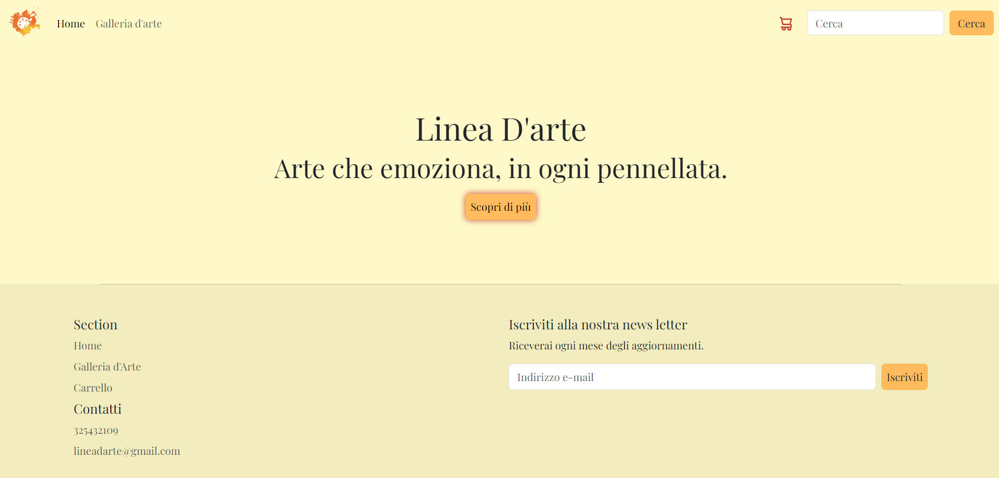
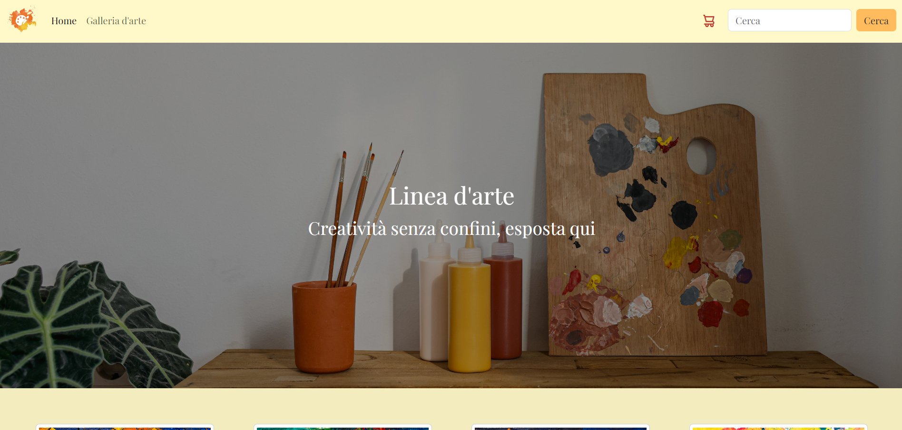
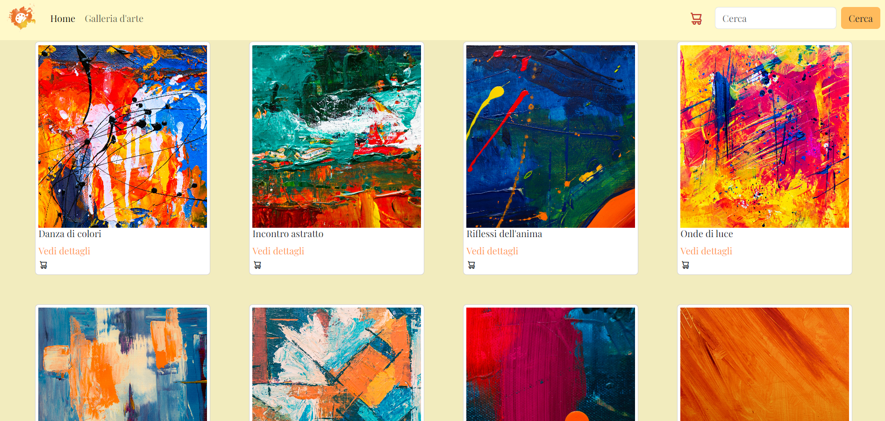
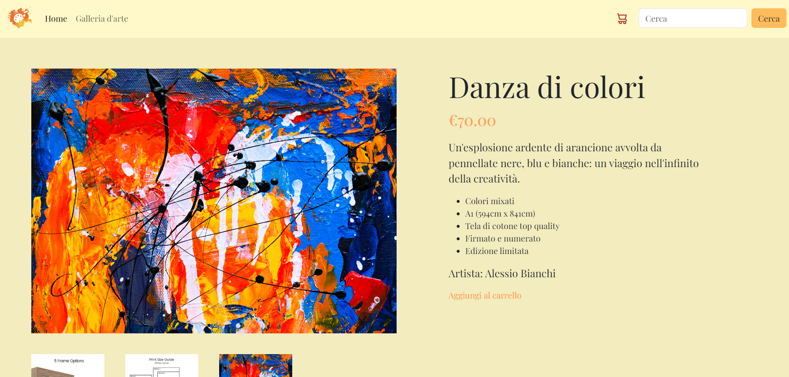
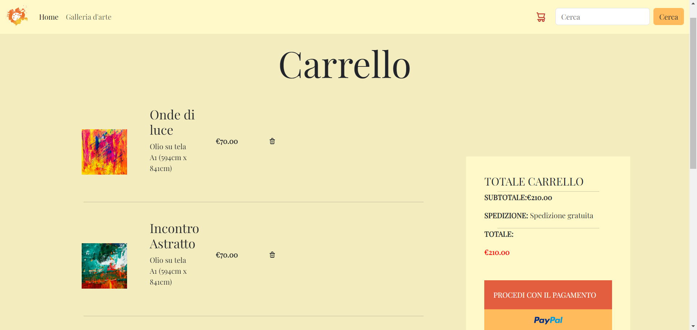
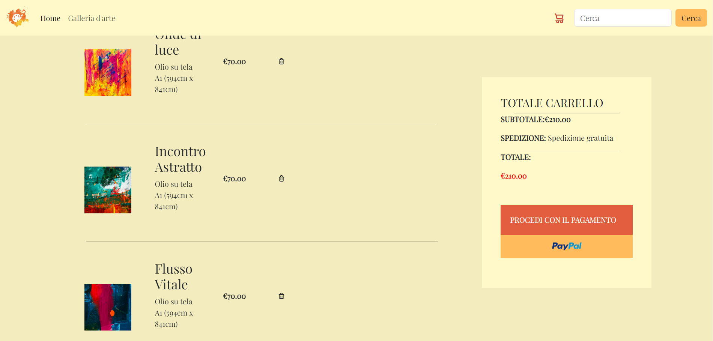
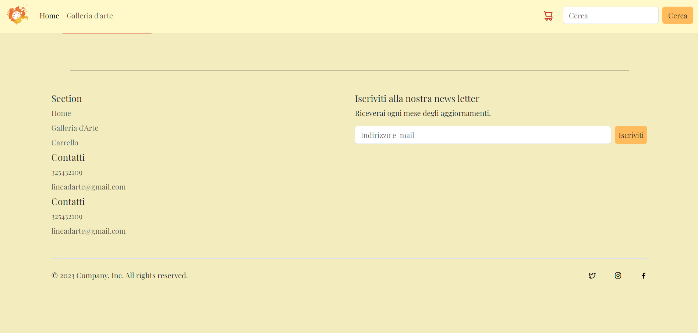

# E-commerce Web App 

Questo progetto è un sito web di arte con la possibilità di visionare e acquistare i quadri. Simula un'e-commerce solo a livello front-end.

## Descrizione

Questo progetto è stato sviluppato con l'obiettivo di fornire una simulazione di un sito di e-commerce, fornendo funzionalità front-end. Gli utenti possono navigare i prodotti disponibili sul sito, aggiungerli al carrello e procedere all'acquisto.

## Funzionalità

Il sito web include le seguenti funzionalità:

- barra di ricerca
- carosello interattivo
- Aggiunta dei prodotti al carrello
- iscrizione alla news letter
- animazioni varie

## Tecnologie utilizzate

La web app è stata sviluppata utilizzando le seguenti tecnologie:

- HTML
- CSS
- JavaScript
- Bootstrap

## Licenza

<!-- Questo progetto è stato rilasciato sotto la licenza MIT. Per ulteriori informazioni, leggere il file `LICENSE.md`. -->

## Crediti

Questo progetto è stato sviluppato da Katia Falletti.(https://it.linkedin.com/in/katia-falletti-616890225?trk=people-guest_people_search-card)
